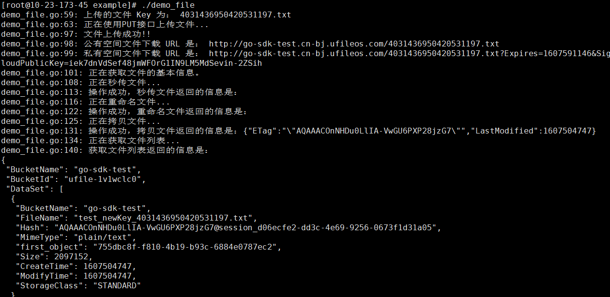

## 环境说明

* 操作系统： CentOS Linux release 8.2.2004 (Core)
* 内核版本：Linux 10-23-173-45 4.18.0-193.el8.aarch64
* go 版本： [go1.15.6.linux-arm64.tar.gz](https://golang.google.cn/dl/go1.15.6.linux-arm64.tar.gz)

**注意：go源码选择 ARM 平台的，而非 AMD**

## 1. 环境准备

### 1.1 go 安装

* 下载解压
<div class="copyable" markdown="1">

  ```shell
  yum install -y  wget
  wget https://golang.google.cn/dl/go1.15.6.linux-arm64.tar.gz 
  tar -xzvf go1.15.6.linux-arm64.tar.gz  && mv go /usr/local/
  ```
</div>


* 添加环境变量

  打开文件 /etc/profile 末尾添加一下内容 
<div class="copyable" markdown="1">

  ```shell
# GOROOT
export GOROOT=/usr/local/go
# GOPATH
export GOPATH=/data/go
# GOPATH bin
export PATH=$PATH:$GOROOT/bin:$GOPATH/bin
  ```
</div>

* 激活配置

<div class="copyable" markdown="1">
  ```shell
  source /etc/profile
  ```
</div>

### 1.2 git 安装配置
<div class="copyable" markdown="1">

  ```shell
  yum install git
  git config --global user.name "xxx"
  git config --global user.email "xxx@xxx"
  ```
</div>

## 2. 运行 SDK
<div class="copyable" markdown="1">

  ```shell
  go get github.com/ufilesdk-dev/ufile-gosdk
  cd $GOPATH/src/github.com/ufilesdk-dev/ufile-gosdk/example
  #配置config.json.example，按其中的说明填写相应参数，并将改文件重命名为config.json
  vim config.json.example; mv config.json.example config.json
  go run demo_file.go
  ```
</div>

## 3. 在ARM平台编译可执行文件
<div class="copyable" markdown="1">

  ```shell
go build demo_file.go #编译
./demo_file           #执行
  ```
</div>




## 4. 在x86架构编译可执行文件

### 4.1 Linux 环境说明

* 操作系统： CentOS Linux release 8.2.2004 (Core)
* 内核版本：Linux 10-9-61-186 4.18.0-193.28.1.el8_2.x86_64
* go 版本： [go1.15.6.linux-amd64.tar.gz](https://golang.google.cn/dl/go1.15.6.linux-amd64.tar.gz)

### 4.2 编译并运行
<div class="copyable" markdown="1">

  ```shell
# 在Linux平台编译ARM平台可执行文件
CGO_ENABLED=0 GOOS=linux GOARCH=arm64 go build demo_file.go
# 在ARM平台中有config.json的目录下运行
./demo_file 
  ```
</div>

